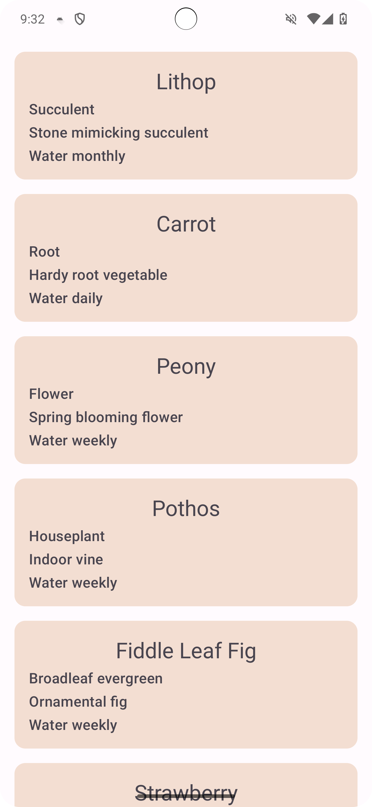
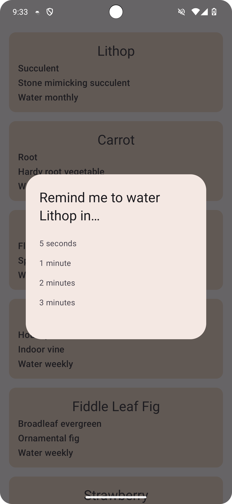
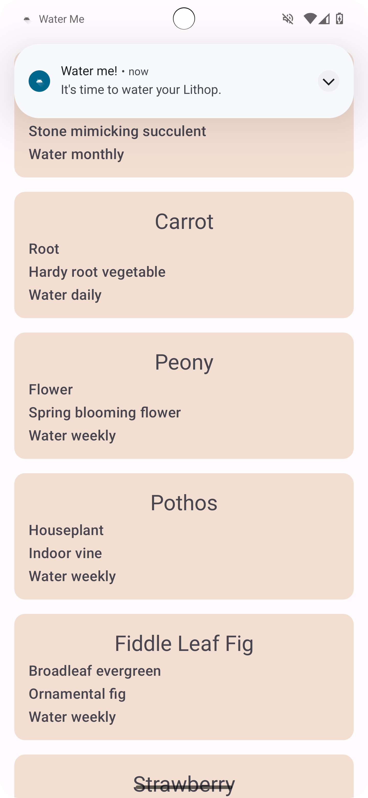

Water Me! app
=======================================

This repository contains the code for the Water Me! app project.

The app currently displays a list of plants in a scrolling list. When you tap on a plant, the app lets you set a reminder to water the plant.

It's developed using Jetpack Compose components like ```Column```, ```Button```, ```Text```, ```Image```, and ```Modifier```.

<p align="center">
  
  
  
</p>

Note: The app requires notifications to be enabled. To enable notifications, navigate to the Android Settings menu > Apps > Water Me > Notifications > Enable "All Water Me notifications".

Getting Started
---------------

1. Download the starter code
2. Open the project in Android Studio
